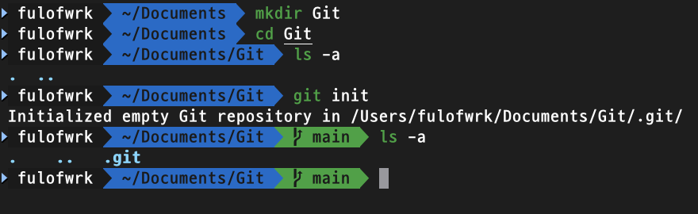

# Git 초기화 설정

---

<br>

Git 으로 버전관리 상태로 만들 폴더 위치에 들어가 다음 명령어를 선언한다. 

```bash
git init
```

명령어를 입력하면 해당 폴더에 ".git" 폴더가 생성된다. 그러면 초기화 설정이 완료된 것이다. 



```bash
# 참고로 git init 을 취소하려면 '.git' 파일을 삭헤하면 된다.
rm -r .git
```

