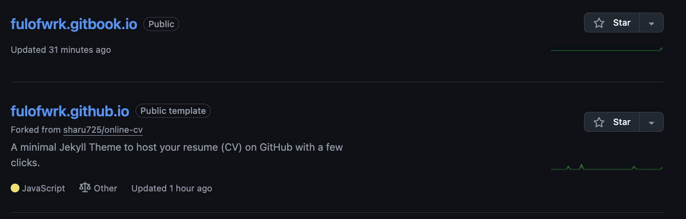
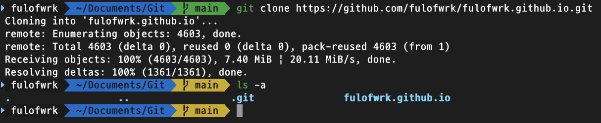
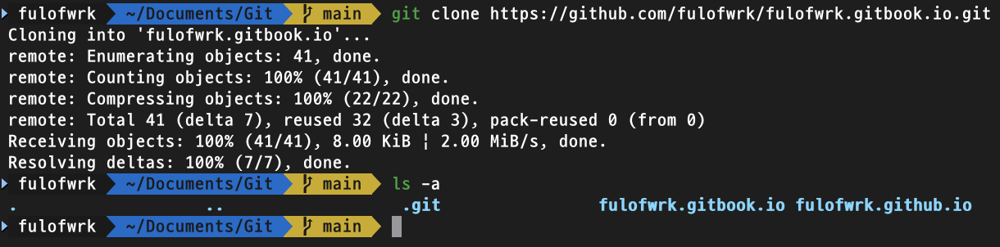

# GitHub 저장소 불러오기

---

<br>

본 저자는 GitHub에 GitHub 블로그 저장소와 GitBook 블로그 저장소를 미리 만들었다. 



하지만 본 저자의 로컬 pc에는 해당 저장소가 저장되어 있지 않기 때문에 GitHub 저장소로부터 정보를 가져 올 필요가 있다. 

먼저 전역(Global) Git 설정을 진행한다. Git은 3가지 범위(전역(global), 지역(local), 시스템(system))로 설정 가능하다. 전역 범위로 설정하면 현재 사용자의 모든 저장소를 포함시키고, 지역 범위로 설정하면 특정 저장소로 한정되고, 시스템 범위로 설정하면 해당 컴퓨터의 모든 저장소와 사용자를 걸쳐서 적용된다. 여러 범위에서 동일한 이름에 대해서 다른 값을 설정했을 경우 좁은 범위의 설정이 우선 적용된다. 

```bash
# 사용자 이름과 이메일 설정
git config --global user.name "fulofwrk"
git config --global user.email "11121000061@g.skku.edu"
```

```bash
# 참고로 config 설정을 지우고 싶으면, --unset 옵션을 사용
git config --global --unset user.name
git config --global --unset user.email
```

그 다음으로 GitHub에 들어가서 로컬 pc에 불러올 저장소의 주소를 가져와 clone을 진행한다. 

```bash
# Clone GitHub repository
git clone https://github.com/fulofwrk/fulofwrk.github.io.git
```



```bash
# Clone GitBook repository
git clone https://github.com/fulofwrk/fulofwrk.gitbook.io.git
```



