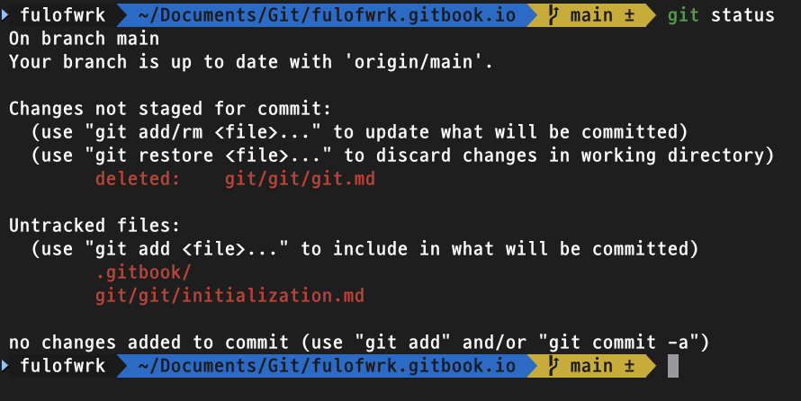
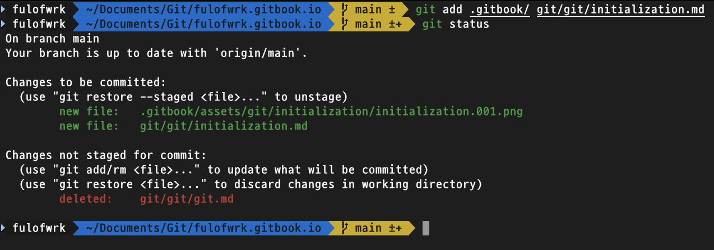
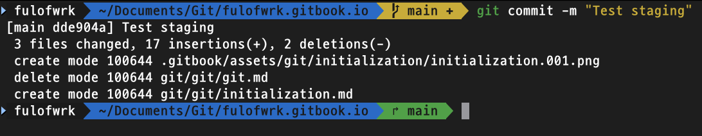
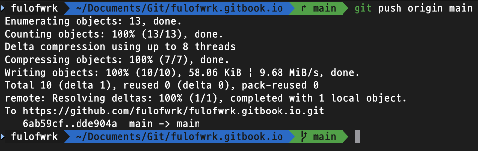
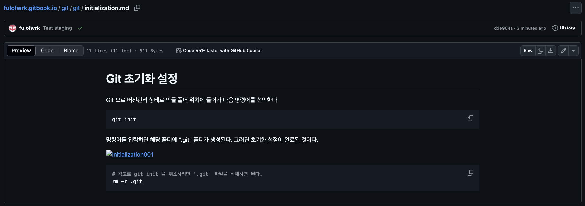

# 로컬 작업 내용 GitHub 저장소에 업로드

---

<br>

Clone한 내용에 대해 추가적으로 작업을 진행하고 GitHub 저장소에 업로드를 시켜보고자 한다. 먼저 현재 프로젝트가 어떻게 관리되고 있는 조회한다. 

```bash
git status
```

__Changes not staged for commit__ 내용에는 파일에는 변경이 일어났지만 아직 commit 되지 않은 내용들이 나타난다. __Untracked Files__ 에는 새로운 파일들이 나타난다. 그래서 추적할 수 없다는 의미로 표현된다. 



```bash
# Staging all files or folders
git add .
# Staing a file or folder
git add <파일명|폴더명>
```

`.gitbook/` 폴더에는 정리하면서 설명하기 위한 이미지를 저장하기 위해 폴더 하위에 assets 폴더를 만들어 이미지를 저장할 생각으로 만들었다. 그리고 첫 블로깅을 위해서 'Git 초기화 설정'에 관한 markdown 문서를 추적할 수 있게 staging 한다(staging 하지 않은 'git.md' 파일에 대한 상태 변화는 아직 남아 있는 것으로 staging 문법에 차이를 알 수 있다) . 



다음으로 commit을 진행한다. 

```bash
# Message 내용에는 작업내용을 입력
git commit -m "<message>"
```



최종적으로 GitHub 저장소에 업로드 한다. 

```bash
# origin은 원격 저장소라는 의미
# main은 브랜치명?
git push origin main
```



업로드가 된 저장소의 모습을 볼 수 있다. 다만 이미지를 제대로 불러오지 못했다. 해당 이미지의 주소를 로컬 주소로 입력해버렸는데 저장소의 위치로 수정했다. 

이미지 주소 예시 : ../../.gitbook/assets/images/git/initialization/initialization.001.png



문제는 GitHub 저장소에는 업로드가 잘 되었는데 GitBook에서의 변화가 없다. 분명 GitBook과 GitHub를 synchronize 설정을 했다. 설정을 uninstall 하고 다시 로그인해서 시도하니 반영된다. 

