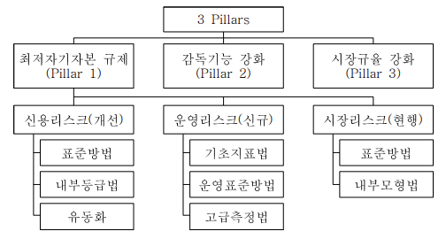

# [Book] 알기 쉬운 신BIS (제1편 : 신용리스크)

# 1. 신BIS협약이란? 제1절 신BIS협약의 개요

Last edited : 2025년 05월 08일, Created : 2025년 05월 07일

---

 

# 1. 신BIS협약이란?

 

신BIS협약은 일명 'Basel II' 라고도 불리며, 은행의 리스크관리 선진화와 자본충실화를 유도하기 위한 종합적인 자본규제제도로서 다음 3개의 축(3 Pillars)으로 구성되어 있다. 신BIS협약이 도입·정착되면 국내 은행산업의 리스크관리 수준이 한 단계 높아지고, 신용평가시장이 활성화되는 동시에 금융감독 시스템이 국제수준으로 향상되는 계기가 될 것으로 예상한다. 

- 최저자기자본 규제(Pillar 1) : 현행 신용·시장리스크에 운영리스크를 추가하고, 신용리스크 측정시 차주의 신용도에 따라 위험가중치를 차등화
- 감독기능 강화(Pillar 2) : 은행의 자본적정성과 리스크관리체계를 감독당국이 점검·평가하고 필요시 적절한 감독조치
- 시장규율 강화(Pillar 3) : 은행의 리스크 수준과 자본적정성에 관한 정보를 시장에 공시하도록 의무화

 

# 제1절 신BIS협약의 개요

 

## 1. BIS자기자본규제 제도의 개요

BIS자기자본규제 제도는 바젤위원회가 상업은행의 신용리스크의 효율적 관리와 국제업무를 영위하는 은행간 형평성 확보를 위해 1988년부터 시행했다. 

- BIS자기자본규제 제도는 은행의 자본적정성 확보를 위하여 위험가중자산의 8% 이상을 자기자본으로 보유하도록 의무화 
  - 상기 비율을 BIS자기자본비율(Capital Adequacy Ratio) 또는 "Cook Ratio"라고 칭함 
- 1990년대 들어 유가증권 및 파생상품거래 증가 등으로 인해 금융기관이 보유하는 자산의 가격변동 리스크가 증대됨에 따라 1997년부터 시장리스크에 대해서도 일정한 자기자본을 보유하도록 개정 

 

## 2. 우리나라의 BIS자기자본규제 제도(SKIP)

 

## 3. 신BIS협약의 도입 배경

바젤위원회는 그 동안 금융환경의 변화로 현행 BIS협약의 유효성이 저하됨에 따라 이를 대체할 신BIS협약 제정을 추진하여 2004.6월 최종 확정했다. 

- 1988년 확정된 현행 BIS협약은 다음과 같은 문제점을 개선할 필요가 있었기 때문에 바젤위원회에서는 신BIS협약을 추진하게 되었다. 
  - 차주별 신용리스크의 차이를 적절하게 반영하지 못하여 모든 기업에 대해 획일적인 위험가중치 적용
  - 금융공학의 발달로 ⚠️`자산유동화` 등을 이용한 ⚠️`규제자본 회피거래(Capital Arbitrage)`가 증가하여 은행의 잠재리스크 증가
  - 최저자기자본 산출시 은행간 리스크관리 능력의 차이를 인정하지 않고 동일한 방법을 적용
  - 부적절한 내부통제, 직원 및 시스템의 실패 또는 외부충격에 따라 발생하는 운영리스크 등 다양한 리스크 미반영

    
💡My opinion or Question

     
    <ui>
        <li>
            O.1. "자산유동화" 개념 정리 필요 
        </li>
        <blockquote></blockquote>
      	<li>
            O.2. "규제자본 회피거래" 개념 정리 필요 
        </li>
        <blockquote></blockquote>
    </ui>

 

## 4. 신BIS협약의 구조

신BIS협약은 최저자기자본 규제(Pillar 1), 감독기능 강화(Pillar 2), 시장규율 강화(Pillar 3)의 3개의 축(3 Pillars)으로 구성된다. 

- 그 동안 규제완화, 전자통신기술·금융공학의 발달을 배경으로 은행의 영업규모가 커지고 그 내용이 복잡다기화됨에 따라 
  - 최저 자기자본규모 산출방식을 정해주고 동 규모 이상으로 자본을 유지토록 하는 방식(Pillar 1)만으로는 은행의 건전성·안정성을 확보하는데 불충분하다고 판단
  - 이에 따라 은행의 리스크관리와 자본적정성평가 시스템에 대한 감독당국의 적극적인 점검(Pillar 2)과 공시강화를 통한 시장 참여자의 감시 유도(Pillar 3)로 보완하고자 하는 것임

    
💡My opinion or Question

     
    <ui>
        <li>
            Q.1. "기존의 Pillar 1에서의 최저 자기자본규모는 어떻게 산출되었는가?" 
        </li>
        <blockquote>
	        '5. 신BIS협약의 주요 내용 Ⅰ - 최저자기자본 규제(Pillar 1)' 내용을 참고하면, 현행BIS협약과 동일하게 자기자본을 총위험 가중자산(신용위험가중자산+시장위험가중자산+운영위험가중자산)으로 나누어 산출한다고 설명되어 있다. 즉, 현행과 동일하다는 뜻인 것으로 해석된다. 다만, Pillar 1에는 운영리스크가 추가되었기 때문에 운영리스크에 대한 부분은 고려하지 않았을 것으로 생각된다. 
        </blockquote>
    </ui>

**신BIS협약의 구조**

 

## 5. 신BIS협약의 주요 내용 Ⅰ - 최저자기자본 규제(Pillar 1)

최저자기자본 규제(Pillar 1)에서는 신용리스크 측정방법을 개선하여 다양하 방법을 제시하고, 기존의 신용·시장리스크 이외에 운영리스크를 추가한다. 

- 자기자본비율 산출
  - 신용리스크 측정시 차주의 신용도에 따라 위험가중치를 차등화하고 정교한 내부 신용평가모형을 갖춘 은행에 대해서는 리스크 측정과 규제자본 산출에 있어 재량 허용
  - 또한 담보, 보증 또는 신용파생상품과 같은 ⚠️`신용위험경감기법`을 현행 협약보다 폭넓게 인정하여 그 동안 발전해온 리스크관리기법을 수용
    - 신용위험경감기법으로 인정하는 담보와 보증의 제공 주체를 국가, 은행에서 일반기업까지 확대하고 담보의 범위도 채권(예금 포함)에서 주식, 금 등으로 확대
    - 또한, 보증 외에 신용파생상품을 통한 신용위험경감효과를 추가적으로 인정하여 은행이 ⚠️`신용보장을 매입`한 경우 신용보장 매도자(protection seller)가 보증을 제공한 것과 동일하게 처리할 수 있도록 허용
  - 자기자본비율은 현행BIS협약과 동일하게 자기자본을 총위험가준자산(신용위험가중자산+시장위험가중자산+운영위험가중자산)으로 나누어 산출
    - 최저자기자본비율은 8%로 현행 기준과 동일

**자기자본비율 산식**
$$
자기자본비율 = \frac{자기자본}{신용위험가중자산 + 시장위험가중자산 + 운영위험가중자산}\times100\geq8\%
$$

    
💡My opinion or Question

     
    <ui>
        <li>
            O.1. "신용위험경감기법이 무엇인가?"에 대한 자료 정리 필요 
        </li>
        <blockquote></blockquote>
        <li>
        	Q.1. "'신용보장을 매입한 경우'의 의미는 무엇인가?"
        </li>
        <blockquote></blockquote>
    </ui>

- 리스크측정방법

  - 신용·운영리스크를 측정함에 있어서 난이도·정교함이 다른 리스크측정방법을 3가지씩 제시하여 은행이 리스크 특성 및 관리수준에 따라 선택

  - 리스크측정방법은 다시 표준방법과 내부모형에 의한 방법으로 구분

    - 표준방법 : 바젤위원회에서 정한 표준적인 방법에 의해 리스크를 산출하는 방법

    - 내부모형 : 은행이 내부 데이터와 리스크측정시스템을 이용하여 리스크를 자체적으로 측정하도록 하는 방법으로 그 적정성을 확보하기 위해 감독당국의 사전 승인이 필요

    - 리스크 종류별 리스크측정방법

      <table>
          <tbody>
              <tr>
                  <td align=center><b>측정방법</b></td>
                  <td align=center><b>신용리스크(개선)</b></td>
                  <td align=center><b>운영리스크(신규)</b></td>
                  <td align=center><b>시장리스크(현행 유지)</b></td>
              </tr>
              <tr>
              	<td align=center>표준방법</td>
                  <td align=center>표준방법</td>
                  <td align=center>기초지표법</td>
                  <td align=center>표준방법</td>
              </tr>
              <tr>
              	<td align=center></td>
                  <td align=center></td>
                  <td align=center>표준방법</td>
                  <td align=center></td>
              </tr>
              <tr>
              	<td align=center>내부모형</td>
                  <td align=center>기본내부등급법</td>
                  <td align=center>고급측정법</td>
                  <td align=center>내부모형</td>
              </tr>
              <tr>
              	<td align=center></td>
                  <td align=center>고급내부등급법</td>
                  <td align=center></td>
                  <td align=center></td>
              </tr>
          </tbody>
      </table>

 

## 6. 신BIS협약의 주요 내용 Ⅱ - 감독기능 강화(Pillar 2)

감독기능 강화(Pillar 2)를 통해서 감독당국은 Pillar 1에서 ⚠️`반영하지 못한 리스크`를 고려하고, 은행 내부의 리스크관리시스템의 적정성 여부를 점검한다. 

    
💡My opinion or Question

     
    <ui>
        <li>
            Q.1. "'반영하지 못한 리스크'가 정확히 무엇을 의미하는가?" 
        </li>
        <blockquote></blockquote>
    </ui>

- 은행이 스스로 리스크를 인식·측정·관리하는 시스템을 갖추도록 한 후, 감독당국은 그 시스템의 적정성 여부를 점검하고 필요한 경우 적절한 감독조치를 취하는 것임 
- Pillar 2에 따라 은행은 업무수행과정에서 나타나는 모든 중요한 리스크(신용/시장/운영리스크뿐만 아니라 은행계정의 금리리스크, 편중리스크, 위기상황분석 등을 포함)를 스스로 평가하고 리스크 수준에 맞는 적정자기자본을 산출·관리하는 절차를 구축·운용하여야 하며, 
  - 감독당국은 이러한 절차의 적정성 여부를 평가하고 그 결과에 따라 필요한 경우 자기자본 확충 요구를 포함한 감독조치를 취하게 됨 
- 또한 감독당국은 개별은행에 대하여 ⚠️`최저자기자본비율(8%)을 초과한 자본금을 보유하도록 요구`할 수 있으며 
  - 은행의 자본이 적정한 수준 이하로 하락하는 것을 방지하기 위하여 조기에 감독조치를 취하여야 함 

    
💡My opinion or Question

     
    <ui>
        <li>
            Q.1. "어떤 경우에 8%를 초과한 자본금을 보유하도록 요구할 수 있는가?" 
        </li>
        <blockquote></blockquote>
    </ui>

 

## 7. 신BIS협약의 주요 내용 Ⅲ - 시장규율 강화(Pillar 3)

시장규율 강화(Pillar 3)에서는 자기자본 내역 및 리스크측정 방법에 대한 공시를 확대하여 시장규율을 강화한다. 

- 은행의 리스크에 관한 정보의 공시를 확충하여 시장참가자가 스스로 이를 평가하고 적절히 대응할 수 있도록 함으로써 시장규율을 강화하자는 것임 
  - 현재 국내에서는 경영지도기준의 하나로 자기자본비율을 산출한 결과치를 제공하고 있으나 
  - Pillar 3에서는 자기자본 내역, 경영지표 산출과정 및 내역, 내부 통제구조 및 기타 항목 등 리스크관리 구조와 관련된 공시항목을 확대하여 
  - 이들 항목에 대한 시장 이해관계자(고객, 투자자, 주주 및 감독당국 등)의 평가를 통해 시장의 규율을 강화하고자 함 
- 이러한 시장규율의 강화는 은행으로 하여금 건전하게 영업활동을 수행하도록 하는 유인을 제공함으로써 감독당국에 의한 규제를 보완하는 역할을 수행 

<table>
    <tbody>
    	<tr>
            <td align=center><b>구분</b></td>
            <td align=center><b>현행BIS협약</b></td>
            <td align=center><b>신BIS협약</b></td>
        </tr>
        <tr>
        	<td align=center>최저자기자본규제 (Pillar 1)</td>
            <td align=center>신용리스크 (모든 기업에 대해 일률적으로 100% 위험가중치 적용)</td>
            <td>
                ① 표준방법(승인불필요, Standardised Approach) 
                적격 외부신용평가기관이 평가한 신용등급에 따라 위험가중치 차등 적용(0~1,250%)
            </td>
        </tr>
        <tr>
        	<td align=center></td>
            <td align=center></td>
            <td>
                ② 내부등급법(감독당국의 승인 필요, IRB: Internal Ratings-Based Approach) 
                은행 자체의 내부신용평가모형 활용 
                i)기본내부등급법(Foundation-IRB) 
                &ensp;은행 자체적으로 PD만 추정하고 LGD, EAD, M은 협약에서 제시 
                ii)고급내부등급법(Advanced-IRB) 
                &ensp;은행 자체적으로 PD, LGD, EAD, M을 추정
            </td>
        </tr>
        <tr>
        	<td align=center></td>
            <td align=center>시장리스크</td>
            <td>현행BIS협약과 동일(트레이딩 계정에 대해서 적용)</td>
        </tr>
        <tr>
        	<td align=center></td>
            <td align=center>-</td>
            <td>
                운영리스크 추가 
                (부적절한 내부절차, 직원, 시스템 또는 외부의 사건으로부터 초래되는 손실리스크)
            </td>
        </tr>
        <tr>
        	<td align=center></td>
            <td align=center></td>
            <td>
                ① 표준방법(승인불필요) 
                총이익을 기준으로 운영리스크 산출 
                i)기초지표법(Basic Indicator Approach) 
                &ensp;총이익의 15%를 운영리스크로 산출 
                ii)표준방법(Standardised Approach) 
                &ensp;8개 사업부문별 총이익의 일정비율(12~18%)의 합을 운영리스크로 산출
            </td>
        </tr>
        <tr>
        	<td align=center></td>
            <td align=center></td>
            <td>
                ② 고급측정법(감독당국의 승인 필요, AMA: Advanced Measurement Approaches) 
                자체의 손실자료와 리스크측정시스템을 활용하여 운영리스크 산출
            </td>
        </tr>
        <tr>
        	<td align=center>감독기능 강화 (Pillar 2)</td>
            <td align=center>-</td>
            <td>
                감독당국은 은행의 내부 자본적정성평가절차를 점검하고 리스크가 높은 은행에 대해서는 최저 비율(8%) 이상의 자본 보유 요구
            </td>
        </tr>
        <tr>
        	<td align=center>시장규율 강화 (Pillar 3)</td>
            <td align=center>-</td>
            <td>
                자기자본 세부내역과 리스크별 측정방법에 대한 공시 확대
            </td>
        </tr>
    </tbody>
</table>

 

## 8. 신BIS협약의 국내 도입시기(SKIP)

 

## 9. 신BIS협약의 국내 도입방법(SKIP)

 

## 10. 내부등급법 승인절차와 사전운영요건

은행의 체계적인 신BIS협약 도입준비 지도를 위해 감독당국의 승인이 필요한 내부등급법 승인절차와 사전운영요건의 주요 내용을 결정하여 제시한다. 

- 내부등급법 승인절차

  - ① 감독당국과의 사전협의와 예비점검 → ② 은행의 내부등급법 승인신청 → ③ 감독당국의 심사 및 승인
  - 은행은 내부등급법 승인신청 전 준비상황에 대해 감독당국과 충분한 의견교환 필요 
  - 승인신청은 적용시점 6개월 이전에 완료토록 하며, 감독당국은 승인신청 접수 후 최장 6개월 동안 승인심사 업무 수행 후 승인 
  - (이러한 신용리스크 내부등급법 승인절차는 운영리스크 고급측정법 승인시에도 동일하게 적용) 

- 사전운영요건

  - 내부등급법 적용 목표 은행은 적용 전 3년간 '최소요건'을 전반적으로 충족하는 신용평가시스템을 갖추고 이를 은행업무에 활용하는 '사전운용요건'을 준수할 필요(단, 신BIS협약 도입업무의 원활한 추진을 위하여 2007년말 기본내부등급법을 적용하고자 하는 은행의 경우에는 승인신청 전 2년간의 사전운영기간을 적용토록 사전운용요건을 완화) 
    - 신용평가시스템의 구축·운영·검증과 활용, 이사회 및 경영진의 감독 강화를 사전운영 기간 중 준수하여야 하는 '최소요건'으로 제시 
    - 사전운영 개시시점에는 최소요건의 완벽한 충족을 요구하지는 않으나, 승인신청시점에는 이를 완벽하게 충족할 필요 

    
📑참고

     사전운영요건의 주요내용
    <ul>
        <li>
            신BIS협약의 내부등급법 최소요건을 전반적으로 충족하는 내부 신용평가시스템의 운영
            <ul>
                <li>
                    ① 신BIS 기준에 맞는 신용평가시스템 구축과 검증
                    <blockquote>
                        > 신BIS 기준에 맞는 신용평가시스템 구축과 리스크요소 산출 
                        > 신용평가모형과 리스크요소에 대한 검증
                    </blockquote>
                </li>
                <li>
                    ② 신용평가시스템의 활용
                    <blockquote>
                        > 신용평가시스템을 규제자본 산출 목적 이외에 은행의 업무에도 활용하여야 함 
                        > 주요 활용업무 
                        &ensp;- 여신의 승인과 가격 결정 
                        &ensp;- 개별 차주, 포트폴리오 수준에서 여신 한도의 설정 
                        &ensp;- 충당금 적립 
                        &ensp;- 신용리스크 관련 보고 
                        &ensp;- 신용리스크 관리전략 수립 
                        > 상기 사항들에 대한 구체적인 지침, 절차의 문서화
                    </blockquote>
                </li>
                <li>
                    ③ 신용평가시스템에 관한 이사회와 경영진의 감독 강화
                    <blockquote>
                        > 신용평가와 리스크측정요소 추정 절차에 관한 중요사항은 이사회와 경영진의 승인을 받아야 함 
                        > 경영진은 신용평가시스템의 설계와 운영에 대해 충분히 이해하고 있어야 하며, 동 시스템이 적정하게 운영되고 있는지 지속적으로 확인하여야 함
                    </blockquote>
                </li>
            </ul>
        </li>
    </ul>

 

