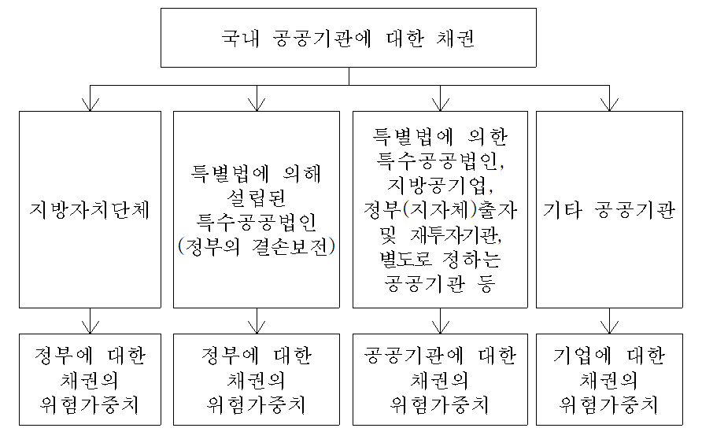

# 2. 표준방법이란? 제1절 위험가중치 적용

Last edited : 2025년 05월 12일, Created : 2025년 05월 12일

---

 

## 11. 정부 및 중앙은행에 대한 채권

각국 정부 및 중앙은행에 대한 채권을 보유하고 있는 경우 해당 국가의 표준신용등급 및 수출신용기관의 국별신용도등급에 따라 위험가중치를 적용한다. 

- 익스포져의 분류 : 각국의 정부 및 중앙은행
- 위험가중치 : 국가에 대한 적격 외부신용평가기관의 신용등급 평가결과(⚠️`국가 표준신용등급`) 및 ⚠️`수출신용기관의 국별신용도등급`에 따라 다음과 같이 적용
  - 대한민국 통화로 표시된 대한민국 정부 및 한국은행에 대한 채권에 대해서는 0%의 위험가중치를 적용

<table>
    <tr>
        <td align=center>국가 표준신용등급</td>
        <td align=center>AAA~AA-</td>
        <td align=center>A+~A-</td>
        <td align=center>BBB+~BBB-</td>
        <td align=center>BB+~B-</td>
        <td align=center>B- 미만</td>
        <td align=center>무등급</td>
    </tr>
    <tr>
        <td align=center>수출신용기관의 국별신용도등급</td>
        <td align=center>0~1</td>
        <td align=center>2</td>
        <td align=center>3</td>
        <td align=center>4~6</td>
        <td align=center>7</td>
        <td align=center>무등급</td>
    </tr>
    <tr>
        <td align=center>위험가중치</td>
        <td align=center>0%</td>
        <td align=center>20%</td>
        <td align=center>50%</td>
        <td align=center>100%</td>
        <td align=center>150%</td>
        <td align=center>100%</td>
    </tr>
</table>

- 국제결제은행(BIS), 국제통화기금(IMF), 유럽중앙은행(ECB) 및 유럽연합(EC)에 대한 채권은 0%의 위험가중치 적용

    
👓예시

     
    <ul>
        <li>
            은행이 달러화 미국재무성채권을 1,000억원 보유시
        </li>
        <blockquote>
            > 미국의 국가신용등급은 AAA(S&P) 
            > 상기 익스포져에 적용할 위험가중치는 0%
        </blockquote>>
        <li>
            은행이 한국은행이 발행한 통화안정증권을 1,000억원 보유시
        </li>
        <blockquote>
            > 우리나라의 국가신용등급은 A(S&P) 
            > 단서조항에 의해 상기 익스포져에 적용할 위험가중치는 0%
        </blockquote>
    </ul>

    
💡My opinion or Question

     
    <ul>
        <li>
            O.1. "국가 표준신용등급"에 대한 명확한 개념 정리 필요 
        </li>
        <blockquote></blockquote>>
        <li>
            O.1. "수출신용기관의 국별신용도등급"에 대한 명확한 개념 정리 필요 
        </li>
        <blockquote></blockquote>>
    </ul>

 

## 12. 공공기간에 대한 채권

공공기관에 대한 채권을 보유하고 있는 경우 표준방법에서 정하고 있는 공공기관 분류기준에 따라 적절한 위험가중치를 적용한다. 

- 공공기간의 분류 및 처리방법

- 위험가중치(공공기관에 대한 채권의 위험가중치)

<table>
    <tr>
        <td align=center>국가 표준신용등급</td>
        <td align=center>AAA~AA-</td>
        <td align=center>A+~A-</td>
        <td align=center>BBB+~BBB-</td>
        <td align=center>BB+~B-</td>
        <td align=center>B- 미만</td>
        <td align=center>무등급</td>
    </tr>
    <tr>
        <td align=center>수출신용기관의 국별신용도등급</td>
        <td align=center>0~1</td>
        <td align=center>2</td>
        <td align=center>3</td>
        <td align=center>4~6</td>
        <td align=center>7</td>
        <td align=center>무등급</td>
    </tr>
    <tr>
        <td align=center>위험가중치</td>
        <td align=center>20%</td>
        <td align=center>50%</td>
        <td align=center>100%</td>
        <td align=center>100%</td>
        <td align=center>150%</td>
        <td align=center>100%</td>
    </tr>
</table>

    
👓예시

     
    <ul>
        <li>
            은행이 한국주택금융공사에 대해 100억원의 원화채권을 보유하고 있는 경우
        </li>
        <blockquote>
            > 한국주택금융공사는 특별법에 의해 설립된 특수공공법인으로서 정부의 ⚠️결손보전이 이루어짐 
            > 정부에 대한 채권의 위험가중치를 적용하여 0%를 적용
        </blockquote>>
        <li>
            은행이 부산교통공단에 대해 100억원의 원화채권을 보유하고 있는 경우
        </li>
        <blockquote>
            > 부산교통공단은 특별법에 의해 설립된 특수공공법인으로서 정부의 결손보전은 이루어지지 않음 
            > 공공기관에 대한 채권의 위험가중치를 적용 
            &nbsp;- 현재 국가신용등급(A등급)을 사용하는 경우 : 50% 위험가중치 
            &nbsp;- 수출신용기관의 국별신용도등급(0등급)을 사용하는 경우 : 20% 위험가중치
        </blockquote>
    </ul>

    
💡My opinion or Question

     
    <ul>
        <li>
            O.1. "결손보전"에 대한 명확한 개념 정리 필요 
        </li>
        <blockquote></blockquote>
        </blockquote>
    </ul>

 

## 13. 국제개발은행에 대한 채권

⚠️`국제개발은행`에 대한 채권을 보유하고 있는 경우 해당 국제개발은행의 표준신용등급에 따라 위험가중치를 적용한다. 

- 국제개발은행에 대한 채권에 대해 다음의 위험가중치를 적용

<table>
    <tr>
        <td align=center>국제개발은행 표준신용등급</td>
        <td align=center>AAA~AA-</td>
        <td align=center>A+~A-</td>
        <td align=center>BBB+~BBB-</td>
        <td align=center>BB+~B-</td>
        <td align=center>B- 미만</td>
        <td align=center>무등급</td>
    </tr>
    <tr>
        <td align=center>위험가중치</td>
        <td align=center>20%</td>
        <td align=center>50%</td>
        <td align=center>50%</td>
        <td align=center>100%</td>
        <td align=center>150%</td>
        <td align=center>50%</td>
    </tr>
</table>

- World Bank Group(IBRD, IFC, IDA, MIGA, ICSID로 구성), ADB, AfDB, EBRD, IADB, EIB, NIB, CDB, IDB, CEDB : 0% 위험가중치 적용

    
💡My opinion or Question

     
    <ul>
        <li>
            O.1. "국제개발은행"이란 무엇인가? 
        </li>
        <blockquote></blockquote>
        </blockquote>
    </ul>

 

## 14. 기업에 대한 채권

기업에 대한 채권을 보유하고 있는 경우 해당 기업의 표준신용등급에 따라 위험가중치를 적용한다. 

- 기업에 대한 채권에 대해 다음과 같은 위험가중치를 적용

<table>
    <tr>
        <td align=center>기업 표준신용등급</td>
        <td align=center>AAA~AA-</td>
        <td align=center>A+~A-</td>
        <td align=center>BBB+~BB-</td>
        <td align=center>BB- 미만</td>
        <td align=center>무등급</td>
    </tr>
    <tr>
        <td align=center>위험가중치</td>
        <td align=center>20%</td>
        <td align=center>50%</td>
        <td align=center>100%</td>
        <td align=center>150%</td>
        <td align=center>100%</td>
    </tr>
</table>

 

