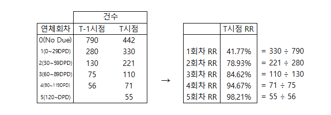
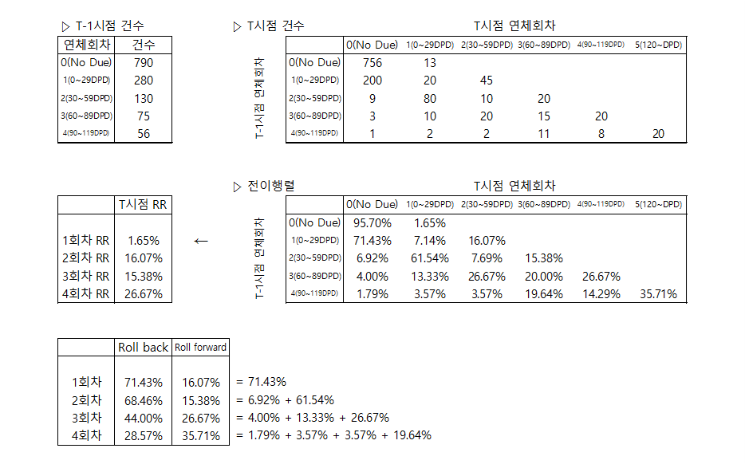
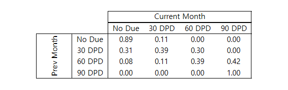

# 전이율 분석 (Roll Rate Analysis)

Last edited : "2025년 05월 12일", Created : "2025년 05월 12일"

---

[참고 Link](https://www.listendata.com/2019/09/roll-rate-analysis.html)

 

# Introduction to Roll Rate Analysis

전이율 분석은 다양한 문제를 해결하는 데 사용되는데, 가장 흔히 사용되는 것은 손실 예측이다. 또한, 'Bad'(비우량) 고객들 정의하는 데에도 사용된다. 일반적으로 Bad 고객은 90일 이상 연체 고객으로 정의한다. 부분 또는 전체 상각도 포함될 수 있다. 전이율 분석은 "Bad 고객을 정의하기 위해 XX일 또는 그 이상의 연체일수를 사용해야 할까?"라는 질문에 답하는 데 도움을 준다. 

 

## How it works?

1. 총 전이율(Gross Roll Rate)

   ① 시점 및 회차 별로 Roll Rate 계산

   ② T시점 N회차 Roll Rate = T시점의 N회차 건수(or 금액) ÷ T-1시점의 N-1회차 금액 또는 건수(or 금액)

   

2. 실제 전이율(True Roll Rate)

   ① T-1시점의 N-1회차 및 T시점 N회차 건수(or 금액) ÷ T-1시점의 N-1회차 건수(or 금액)

   

 

## How to choose bad definition

실제 연체율에서 확인한 것처럼 Roll Backward 하는 경우의 비중이 현저하게 떨어지는 bucket을 선택할 수 있다. Roll Backward 하는 경우가 적다는 것은 고객이 다시 정상 상태로 돌아오기 어렵다는 것이다. 

 

# Loss Forecasting

전이율 분석과 마코프체인을 활용해, 포트폴리오 레벨에서의 신용 손실을 예측할 수 있다. 

 

## Markov Chain

⚠️(Adding other page)`Markov Chain`

    
🔎Markov Chain

     
    <ul>
        <li>간략 설명</li>
        <blockquote>
            마코프 체인은 다음 상태가 이전 상태에 따라 달라지는 무작위 과정이다. 현실세계의 예제는 다음 단어를 예측하는 일이다. 여러 문장에서의 특정 단어 다음으로 나오는 단어를 카운팅하는 것처럼 "안녕"이라는 단어가 나왔을 때, 다음으로 나올 수 있는 단어의 비중을 알 수 있다. 다음 단계는 다음 단어를 무작위로 선택하는 일이다. 이전 상태는 선택된 단어가 되고, 다음 상태는 다음에 나올 수 있는 단어와 그 개수이다. 신용위험에서 이전 상태는 전월의 계좌 실적을 의미하고, 다음 상태는 다음 달의 계좌 실적을 의미한다. 
        </blockquote>
    </ul>

## Transition or Migration Matrix

연체 계정을 한 기간에서 다른 기간으로 이전 또는 전환하는 과정이다. 특정 기간대에서 다른 기간대로의 다양한 연체율에 속하는 고객의 비율인 확률을 사용할 수 있다. 예를들어 고객의 89%는 다음 달에도 미납하지 않는 상태(No Due)를 유지하고 그 중 11%는 다음 달에 0~29 DPD로 전환했다. 

아래 표의 데이터가 지난 달에 다양한 연체 상태에 속하는 고객수를 나타낸다고 가정해보자. 

<table>
    <tr>
        <td align=center><b>연체상태유형</b></td>
        <td align=center><b>고객수</b></td>
    </tr>
    <tr>
        <td align=center>No Due</td>
        <td align=center>20000</td>
    </tr>
    <tr>
        <td align=center>DPD30</td>
        <td align=center>750</td>
    </tr>
    <tr>
        <td align=center>DPD60</td>
        <td align=center>250</td>
    </tr>
    <tr>
        <td align=center>DPD90</td>
        <td align=center>0</td>
    </tr>
</table>

 
